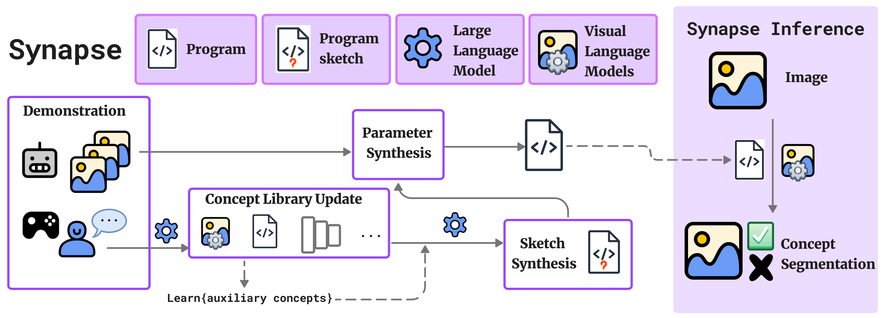

# SYNAPSE: SYmbolic Neural-Aided Preference Synthesis Engine
[](https://arxiv.org/abs/2403.16689)
[-red)]()
[](https://amrl.cs.utexas.edu/synapse/)
[-orange)]()

This is the official repository for AAAI 2025 paper **SYNAPSE: SYmbolic Neural-Aided Preference Synthesis Engine**. SYNAPSE addresses the problem of preference learning, which aims to align robot behaviors through learning user-specific preferences (e.g. “good pull-over location”) from visual demonstrations. Despite its similarity to learning factual concepts (e.g. “red door”), preference learning is a fundamentally harder problem due to its subjective nature and the paucity of person-specific training data. We address this problem using a novel framework which is a **neuro-symbolic** approach designed to efficiently learn preferential concepts from limited data. SYNAPSE represents preferences as neuro-symbolic programs – facilitating inspection of individual parts for alignment – in a domain-specific language (DSL) that operates over images and leverages a novel combination of **visual parsing, large language models, and program synthesis** to learn programs representing individual preferences. We perform extensive evaluations on various preferential concepts as well as user case studies demonstrating its ability to align well with dissimilar user preferences. Our method significantly outperforms baselines, especially when it comes to out-of-distribution generalization.

## Overview


## Setup
- git clone --recursive git@github.com:ut-amrl/synapse.git
- conda create -n synapse python=3.10
- install torch based on your cuda specs from [here](https://pytorch.org/get-started/locally/)
- ./setup.sh
- Download test bags from <put url>

## Usage

## Citation
If you find this project helpful for your research, please consider citing the following BibTeX entry.
```BibTex
@misc{modak2025synapsesymbolicneuralaidedpreference,
      title={SYNAPSE: SYmbolic Neural-Aided Preference Synthesis Engine}, 
      author={Sadanand Modak and Noah Patton and Isil Dillig and Joydeep Biswas},
      year={2025},
      eprint={2403.16689},
      archivePrefix={arXiv},
      primaryClass={cs.RO},
      url={https://arxiv.org/abs/2403.16689}, 
}
```